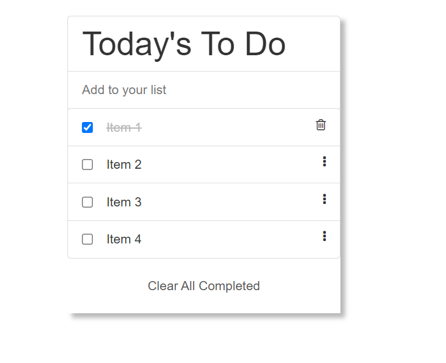

# TODO LIST

> In this project,I build a simple HTML list of To Do tasks.

This simple web page is built using webpack and served by a webpack dev server.

## Built With

- HTML, CSS, JAVASCRIPT
- WEBPACK, GIT, LINTERS.

## Live Demo

[Live Demo Link](https://ntwali-josue.github.io/todo-list/src/index.html)

## Author

👤 **KARANGWA Ntwali Josue**

- GitHub: [Ntwali-Josue](https://github.com/Ntwali-Josue)
- Twitter: [JosueNtwali](https://twitter.com/JosueNtwali)
- LinkedIn: [karangwa](https://linkedin.com/in/karangwa)

## 🤝 Contributing

Contributions, issues, and feature requests are welcome!

Feel free to check the [issues page](https://github.com/Ntwali-Josue/todo-list/issues/).

## Show your support

Give a ⭐️ if you like this project!

## Acknowledgments

- Hat tip to anyone whose code was used
- Inspiration
- etc

## 📝 License

This project is [MIT](./MIT.md) licensed.
